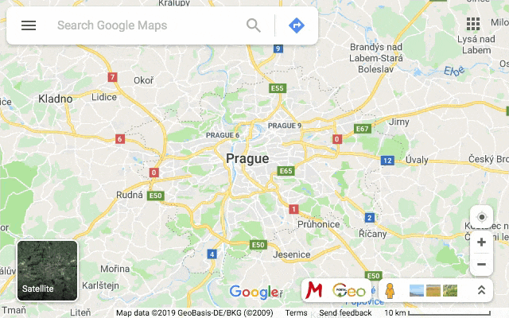

<h1 align="center">MapSwitcher</h1>
 

A browser extension to switch between map websites.

 

About
-----
*MapSwitcher* is a small browser extension which adds buttons to various map services for opening the displayed location in a different service.

Currently supported is switching between Google Maps and Mapy&#46;cz.

This is a small summer project which I did to get some practice with developing browser extensions. There are a few similar projects available, but I didn't like their user experience, so I wanted to make a free, simple, open source alternative which would suit my needs and would integrate well with the supported services.

Installation
------------
*MapSwitcher* currently supports Google Chrome, Mozilla Firefox and Opera.

To install, download the extension either from the [Chrome Web Store](https://chrome.google.com/webstore/detail/mapswitcher/eogccmggebhlkjdjhlgddmnkffjfjamo) or the [Firefox Add-Ons](https://addons.mozilla.org/en-US/firefox/addon/map-switcher/) portal.

Usage
-----
*MapSwitcher* adds buttons to the tools sections of Google Maps and Mapy&#46;cz, clicking on which opens the currently displayed location in Google Maps or Mapy&#46;cz.
In the extension options you can decide which buttons will be shown, as well as whether the new map will open in a new tab.

Developing
----------
*MapSwitcher* is a fairly standard WebExtension, prepared to work in all the major browsers supporting WebExtensions.
Currently it is tested to work in Google Chrome, Mozilla Firefox and Opera, with support for Microsoft Edge coming as soon as Edge officially switches to a Chromium base in the stable releases.

The extension injects content scripts to the supported services, which on load of the page insert the desired buttons to the DOM.
When clicking those buttons, the currently displayed location gets extracted from the page URL and gets converted to the coordinate system used by the target service,
from which the target URL is assembled and then opened.

Links
-----
- [Project homepage](https://www.nesveda.com/projects/MapSwitcher/)
- [Project repository](https://www.github.com/fnesveda/MapSwitcher/)

Licensing
---------
The code in this project is licensed under the MIT license.
Everybody is welcome to use, change and modify the project as they see fit.

The Google Maps and Mapy&#46;cz logos are registered trademarks of their respective owners, and are used within this project only for identification purposes.
